# Module 5: Amazon Detective

This is a re:invent 2019 only module. For the rest of this session you will have hands on time with the new investigative service, __Amazon Detective__, that is currently in gated preview. 

**Note** This module is separate from each of the previous modules and involves separate infrastructure, accounts and attack vectors, but do not log out of the account you were using. 

**Agenda**

1. Switch Roles to Demo Account
2. Start with a Amazon GuardDuty finding
3. Investigate with Amazon Detective
4. What did you find = Prizes!
5. What happened ? - Scenario discussion

### Switch Roles to Detective Demo account
In same browser were you are logged in, go this URL:

<nobr><https://signin.aws.amazon.com/switchrole?roleName=WorkshopReadOnly&account=549639478491></nobr>

!!! note "Attention: Multiple Roles available"
	 You will need to change ```WorkshopReadOnly``` to one of the following
	 ```WorkshopReadOnly-1```
	 ```WorkshopReadOnly-2```
	 ```WorkshopReadOnly-3```
	 ```WorkshopReadOnly-4```
	 You may have to try more than one role.

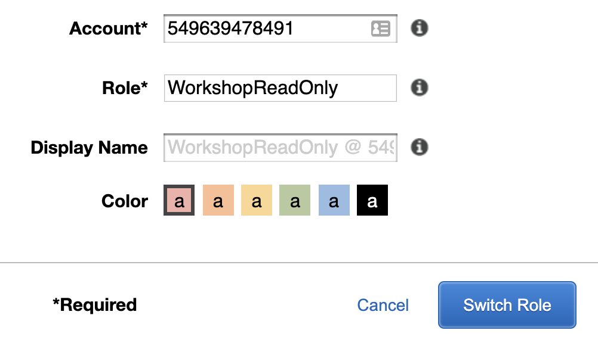

After you make the changes to the ```Role``` field, click ```Switch Role``` to login to that role in the Demo Account. You may have to try more than one role.

### Change Region
Amazon detective is only available in 5 regions at launch. For this workshop you will be using the ```US East (N. Virginia)us-east-1``` region, please select this region from the dropdown in the upper right hand of your AWS Console.

### Start with Amazon GuardDuty

You will initiate your investigation from an AWS detection source, in this case, Amazon GuardDuty. As a security analyst you will be familiar with multiple attack vectors, but for this scenario, we are going to start with a high severity cryptocurrency finding and pivot into Detective to leverage it’s analytical power to discover the scope and depth of an attacker’s foothold in your workloads.

!!! info "You can do this section at your own pace or follow along with the presenter"

Go to the GuardDuty console and select the ```Crypto_Mining_Finding_Types``` saved filter from the drop down menu in the upper right hand corner. Select, click the checkbox, for the ```CryptoCurrency:EC2/BitcoinTool.B``` finding with the resource that has <nobr>```i-0441b8673fab0f671```</nobr> as the instance ID.

Finally, using the ```Actions``` tab, select the drop down and select ```Investigate```. 
 
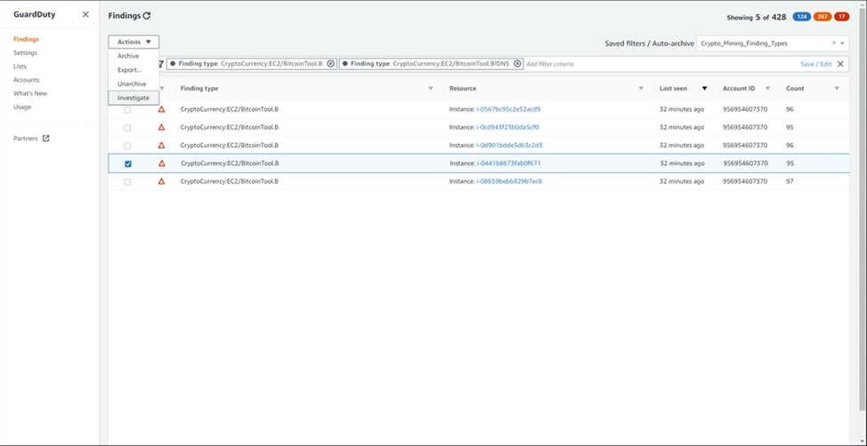

You are now utilizing the deep integration between the various AWS security services to pivot from GuardDuty as your entry point into Detective. 

!!! info "Remember we are playing the part of a security analyst. Take good notes."

### Investigate with Amazon Detective

Let's review the finding profile of the selected finding.  Any time you see the small blue ```info``` link, next to a panel heading, you can click to enable more information in the right hand sidebar. 

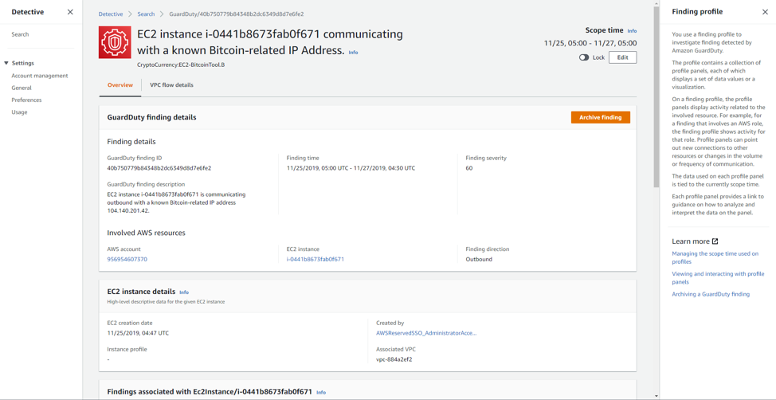

!!! info "Review the information in GuardDuty finding details panel, instance details."

!!! question "Did you notice the 'Edit' button next to scope time? This will be important very soon!"
 
Scroll down to the ```Findings associated with Ec2Instance``` panel.

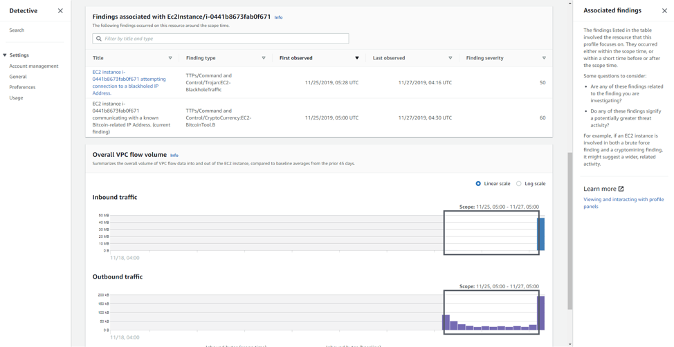

As a security analysts we are always interested what other findings are associated with the resources we are investigating, this is just one part of enabling a unified view of user and resource interactions over time.

Next Scroll down to ```Overall VPCflow``` panel click on the ```info``` link for an explanation of what you are seeing in the panel.


We are looking at the VPCflow volume for this specific instance. Observe that there is a relatively short time period of volume based on the what we observe in the time series panel data.  Most likely this instance was recently spun up.

Scroll back up to the top of the page and click on the ```VPC flow details``` tab.  Take note of the ```Remote IP address``` in this panel. <!--and explain that we are looking at any IP addresses associated with this finding.  Take a note of the IP address and add it to our analyst notes.  We want to include any IoCs in our investigation and keep track of all impacted resource. -->

Let's now determine if any other instances are communicating with this IP address.  Right click on the IP address and open the link in a different tab.  Here we are trying to scope the depth and breath of what other footholds the attacker might have in your network.


After switching to the new browser tab, scroll down to the ```Findings associated with IP address``` panel, we observe additional findings related with this IP address.  In your investigation you should note any other instances that are talking to this bitcoin mining IP address for a possible secondary investigation. <!--(Note: The Findings associated with IP address panel currently shows historical GuardDuty findings even the ones I archived).  -->

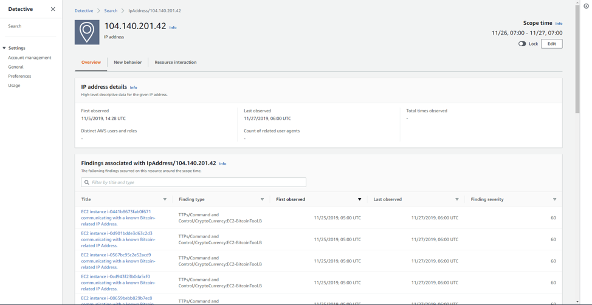

After you have written down all of the instances impacted in the current investigation, we will want to determine the credentials used to spin up these instances.  On our original browser tab, go back to the ```Overview tab``` and scroll down to the ```EC2 instance details``` panel and look for the ```Created by``` field.  This shows us what role was associated with this finding and what user’s credentials might have been compromised. <!--(Note:  We will need to explain that the naming convention for the role is associated with AWS SSO roles and is also a federated role type.)
-->

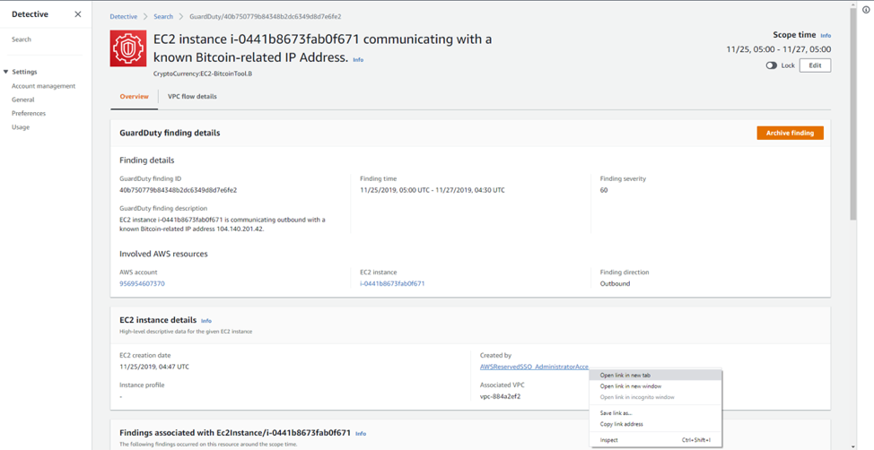

It is important to realize that we are pivoting from a VPCflow data source (IP Addresses information) to a Cloudtrail data source (EC2 Instance Created By Role information). Amazon Detective makes this simple, seamless transition by having access to the metadata associated with the each data source.

Right click on the link under the ```Created by``` header and open in a new tab.

On the ```Role details``` panel scroll down to the ```Overall API call volume``` panel. 

!!! note "Note: There is activity before the current scoping time.  The current timeframe includes the past 24 hours but by using the time series graph we can focus our investigation to include a select time window of the activity"

<!--Explain the time series graph with the black box which means that our current time frame needs to be expanded to include all activity.!-->  We will increase the scope time of this investigation to include some of the previous activity and then lock the time frame with the toggle so the scope time persists during the rest of the investigation. 

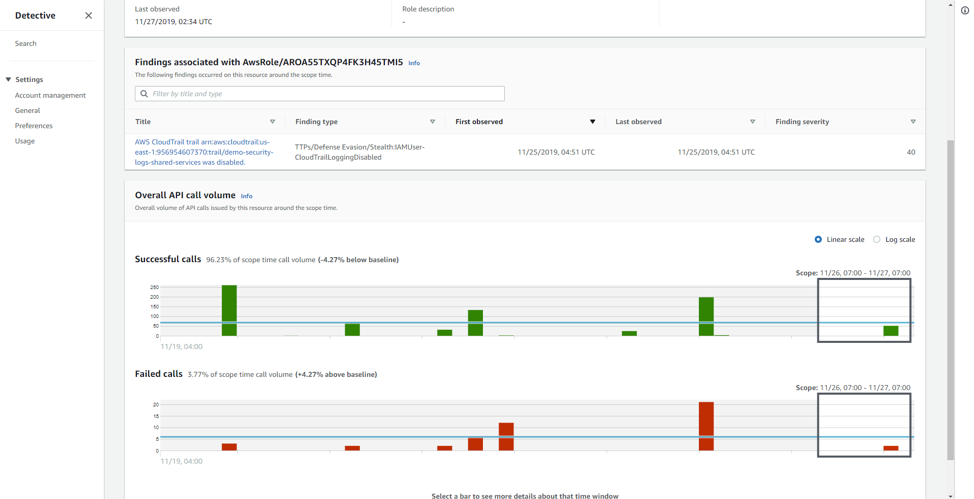

Click on the ```Edit``` button right below ```Scope time``` in the upper right hand corner and change the ```Start``` window to ***```2019/11/14```***, toggle the lock slider and select ```Update scope time```


We can now see there are additional findings associated with this user role after expanding our time frame. Note the expanded black box in the ```Overall API call volume``` panel.
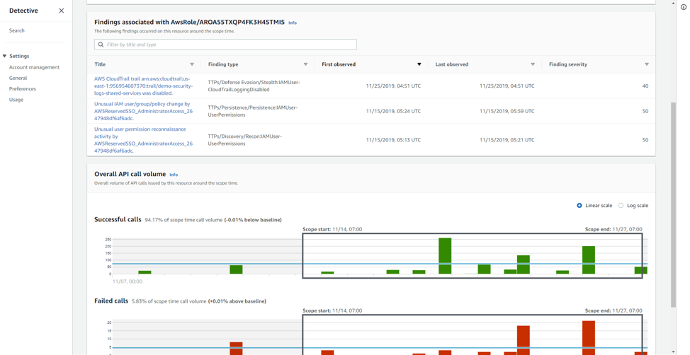

Our next step is to determine if there is any new behavior with this user role.  

Select the ```New Behavior``` tab and observe the ```Newly observed geolocations``` and what it is showing.

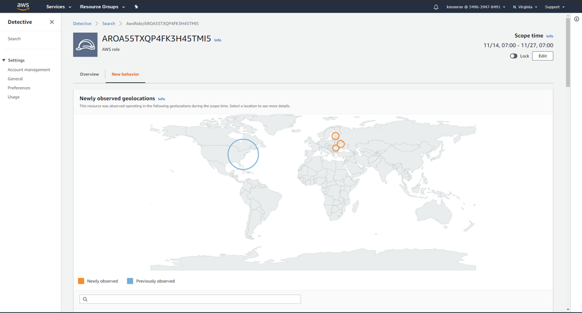

!!! note "Take note of the Newly observed and Previously observed highlights and the actual locations (Ukraine, Estonia, and Romania)"

By selecting one of the circles on the map or selecting the ```Details``` link on the right hand side of the panel, observe the IP addresses associated with each country and take a note of them in your analyst notes.  We use these IP addresses as Indicators of Compromise (IoCs) in our investigation of Cloudtail logs. 


<!--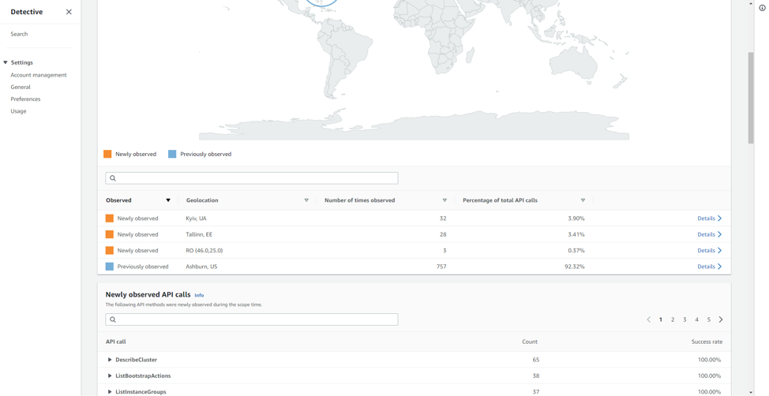-->


This is a great time to checkout some of the API calls in this timeframe that are associated with these IP addresses.  Observe the impacted resources/services but not we don’t need them to write them down for this workshop.

Next, we are going to take a look at ```Newly observed user agents``` panel down at the very bottom of this AWS Role page.

Take note of the super suspicious user agent and expand out the time series graph to determine the timeframe of activity.  The activity aligns with our current scoping time so we don’t need to adjust it further. 

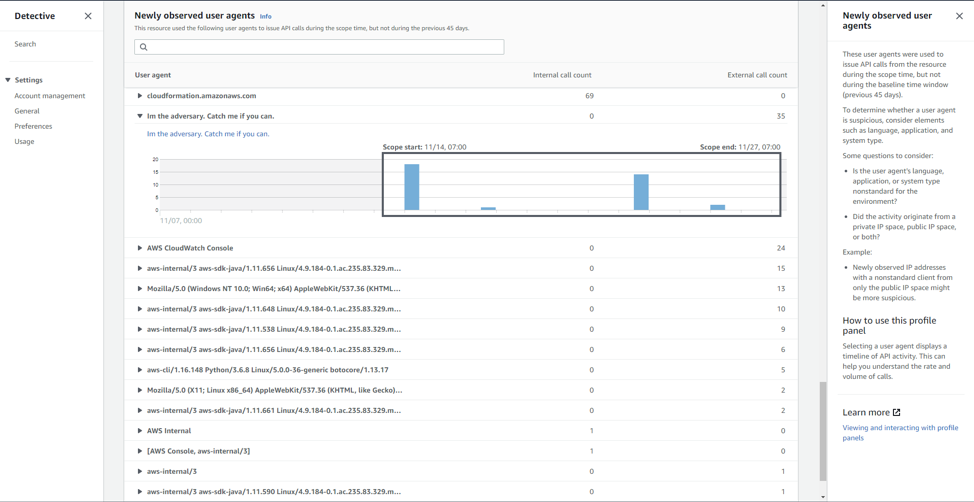

!!! note "Are all these User Agents legitimate? Or do some look suspicious? Remember take good notes."

Next open the ```Im the adversary. Catch me if you can``` user agent in a new tab, by right clicking and selecting 'Open Link in new Tab'.  Here we are once again pivoting on another field in the Cloudtrail metadata source to get any other IoCs or impacted resources. 

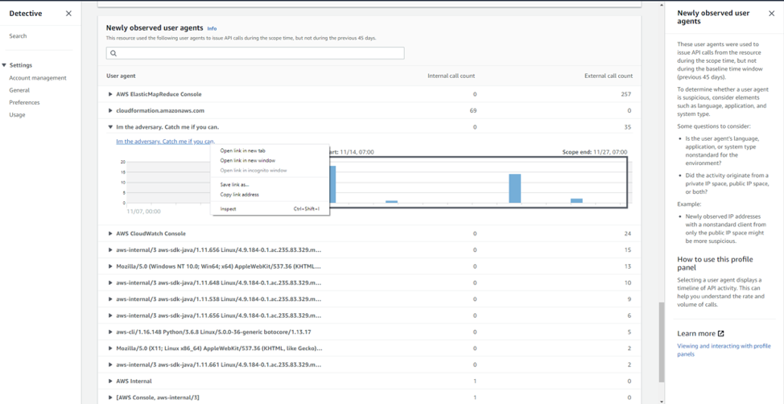

Once we pivot over to the user agent panel, select the ```Resource interaction``` tab and take note of the activity.  Notice that there appears to be more than one impacted user.  Most likely an indication that the attacker created a user(s) with long lived credentials for persistence in your environment.

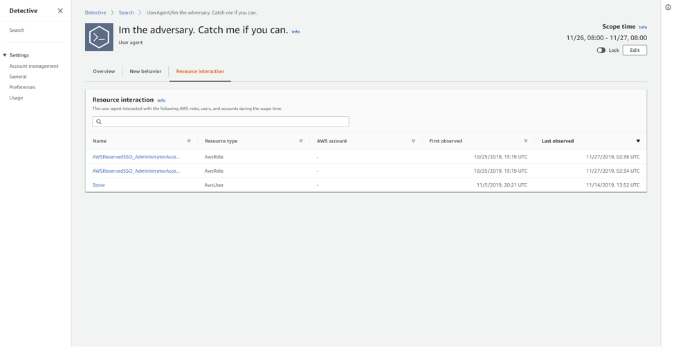

### What did you find = Prizes!
 Be prepared to discuss what IoCs you found:
 Any suspicious IP Addresses, User agents, instance IDs or users
 
### What happened during the scenario?
 
??? note "Are you curious about what happened, open this drop down"
 	  
 
 
 
 